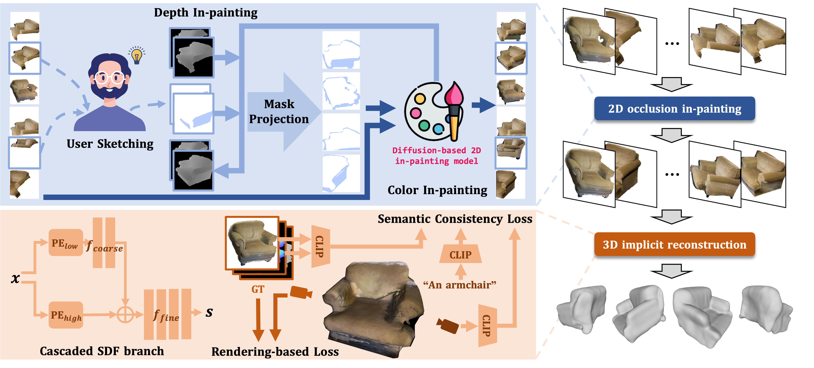
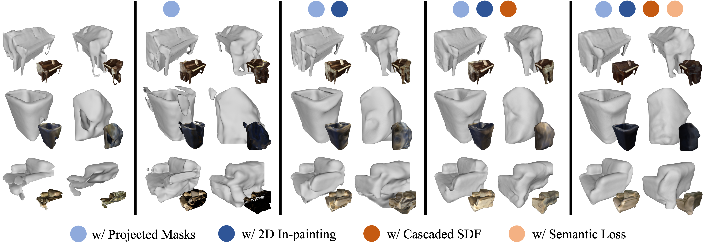

# $\rm O^2$-Recon

[[`Paper`](https://arxiv.org/abs/2308.09591)]


> $\rm O^2$-Recon: Completing 3D Reconstruction of Occluded Objects in the Scene with a Pre-trained 2D Diffusion Model <br>
[Yubin Hu](https://github.com/AlbertHuyb), Sheng Ye, Wang Zhao, Matthieu Lin, [Yuze He](https://github.com/hyz317/), Yu-Hui Wen, Ying He, Yong-Jin Liu <br>
AAAI 2024
> 

## News

🌟 [2024/11/12] We've released all of the related code and [[data](https://huggingface.co/datasets/AlbertHuyb/O2-Recon/tree/main)]!

## Introduction
O2-Recon is a 3D surface reconstruction framework for occluded object. It utilizes a pre-trained diffusion model to in-paint the occluded regions in 2D image domain, and enhances the reconstruction of unseen regions with cascaded SDF branch and CLIP semantic consistency loss.

<p align="center" width="100%">
    
</p>

Our ablation studies demonstrate the effectiveness of our designs.

<p align="center" width="100%">
    
</p>

## Environmental Setup

Install the required packages:
  ```
  conda create -n O2-recon python=3.7
  
  conda activate O2-recon
  
  pip install torch==1.7.1+cu110 torchvision==0.8.2+cu110 torchaudio==0.7.2 -f https://download.pytorch.org/whl/torch_stable.html
  
  git clone --recurse-submodules https://github.com/THU-LYJ-Lab/O2-Recon.git
  
  cd O2-Recon
  
  pip install -r requirements.txt
  
  pip install git+https://github.com/openai/CLIP.git
  ```

Download the normal prediction model `scannet_neuris_retrain.pt` from folder `jiepeng@connect.hku.hk > GitHub >NeuRlS > pretrained normal network > snu
` in this [OneDrive](https://connecthkuhk-my.sharepoint.com/:f:/g/personal/jiepeng_connect_hku_hk/Er7bpbBAxMBBnZfDvdvrO1kBu2tkTpnMw9XXfeuQzkwOlA?e=Yf0Bbj) and store it to `./preprocess/surface_normal_uncertainty/checkpoints/`


## Dataset Preprocessing

### Processed Data
You can download some in-painted examples from [here](https://huggingface.co/datasets/AlbertHuyb/O2-Recon/tree/main/example-input): .
After downloaded, unzip the file into the directory `./dataset/indoor-paper`. 

### Prepare Data from Scratch
We provide an example to prepare the dataset from scannet format.

#### 1. Download ScanNet Scenes

Download several scenes of the whole scannet dataset. You can download the scenes we utilized from [here](https://huggingface.co/datasets/AlbertHuyb/O2-Recon/tree/main/scannet). Unzip the files into `./scannet/scenexxxx_xx_scannet` directories.

#### 2. Parse the Scene Data into Object Directories

Depending on which scenes you'd like to process, you need to modify L150 in `preprocess/object_mask_with_clip.py`. And then run

```
python preprocess/object_mask_with_clip.py
```

This script extracts objects from the scannet scenes according to instance masks and semantic categories. As a result, the object data is extracted into `./scannet/object_original_with_clip/scenexxxx_xx_scannet_obj_x`. 

#### 3. Select and Create In-painting Masks

You can download our created masks from [here](https://huggingface.co/datasets/AlbertHuyb/O2-Recon/blob/main/annotated_masks.zip). Or you can generate the masks and name them following the same manner. We utilize the `xx_class_inpaint mask.png` file under each directory.

After downloaded, place the directories to correct locations. For example, place the `only-seg-0008-obj10` directory under `/path/to/O2-Recon/scannet/object_original_with_clip/scene0008_00_scannet_obj_10/`. 

#### 4. Generate the Data Tree for Training
Based on these object directories, next we generate the in-paintings and predict the monocular cues.

Depending on which scenes you'd like to process, you need to modify L41 in `exp_preprocess.py`. 

And then run 

```
python exp_preprocess.py --data_type scannet-with-inpaint --scannet_root=/path/to/O2-Recon/scannet/ --neus_root=/path/to/O2-Recon/dataset/indoor-paper/ --dir_snu_code /path/to/O2-Recon/preprocess/surface_normal_uncertainty/
```
Here you need to use **absolute paths**.

## Training

Run training and mesh extraction with our example script. For example, run the following script to reconstruct all objects in scene `scene0005_00`:

```
bash scripts/train_0005.sh
```

This script reconstruct the objects one-by-one. After all the steps finished, the reconstructed results and middle results can be found under `/path/to/O2-Recon/exps-paper/indoor-paper/neus`.

## Evaluation

### 1. Download the ground truth data.

We have prepared the ground truth data from both scannet and scan2cad annotations. You could download them from [[HuggingFace](https://huggingface.co/datasets/AlbertHuyb/O2-Recon/tree/main/groundtruth)]. 

### 2. Collect output data of your method.

Organize the output data of your method in a certain way. You could download our example results, including the full results of baseline methods and O2-Recon, from [[HuggingFace](https://huggingface.co/datasets/AlbertHuyb/O2-Recon/blob/main/example-results.zip)]. 


### 3. Run the evaluation script.

```
conda activate O2-recon

python evaluation/cal_metric.py 
```


## Citation

```
@inproceedings{hu20242,
  title={O\^{} 2-Recon: Completing 3D Reconstruction of Occluded Objects in the Scene with a Pre-trained 2D Diffusion Model},
  author={Hu, Yubin and Ye, Sheng and Zhao, Wang and Lin, Matthieu and He, Yuze and Wen, Yu-Hui and He, Ying and Liu, Yong-Jin},
  booktitle={Proceedings of the AAAI Conference on Artificial Intelligence},
  volume={38},
  number={3},
  pages={2285--2293},
  year={2024}
}
```